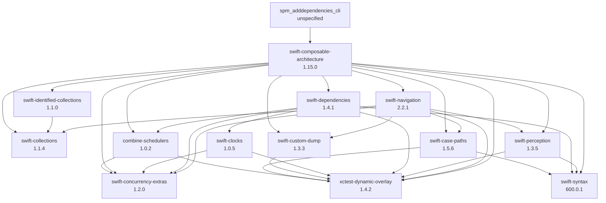

As projects grow in complexity, it is common to use two techniques: 

1. Depend on external libraries. 
2. Split your codebase into multiple smaller modules. 

These techniques have a number of benefits including: 

1. You can reduce build times by only building select modules, instead of the entire project. 
2. You can reuse modules in other projects. 
3. Swift forces you to define external APIs with the `public` keyword, thus enforcing best practices. 

But a modularized codebase also increases complexity by creating a web of dependencies. Small changes in one module, can have vast ripple effects down the dependency chain. For this reason, it can be immensely helpful to visualize your dependency graph like this.


Here are a few methods to do so in the Swift ecosystem. 

## Assessing Dependencies Before Adding Them
Ideally, it is best to assess your dependencies **before** you depend on them. You don't want to be put in a situation where you depend on a module: 

1. with a license that is incompatible with your business model 
2. that hasn't been maintained in ages
3. doesn't support the platforms you need
4. that has a security flaw
5. that violates your privacy policy
6. many other issues...

Of course, we can investigate many of these issues by viewing the GitHub page (or wherever it is hosted). If it has a package page on [Swift Package Index](https://swiftpackageindex.com/) then you can see even more helpful metrics. (See [here]() for how you can take full advantage of Swift Package Index.)

## Transitive Dependencies
However, it is important not to forget your transitive dependencies. In other words, if you depend on "A", and "A" depends on "B", then you **also** depend on "B". Therefore, we should look at our immediate dependencies, assess them, look at **their** dependencies, assess them, and follow this chain until we have assessed all of the transitive dependencies. Not only that, ideally, you should repeat this process when packages are updated. This can be quite tedious and error prone. Let's look at some tools to make this easier. 

## Viewing Dependencies in a Package.swift Manifest
Perhaps the most obvious place to look is in the Package.swift manifest of each package. Here you can see every target that is defined by the package, and each of their dependencies. This is the source of truth and tells you everything you need to know to find your answers. But it doesn't make it easy to assess your entire dependency graph. 

For one, this will only show the dependencies that are explicitly mentioned in the Package.swift file. It will not include transitive dependencies. So, you will need to go to each dependency's repo (at the correct version) and view their Package.swift file. This approach is not very scalable. 

## Viewing Dependencies on GitHub
Next we can use the "Insights" feature on GitHub. First go to the repo, then click the "Insights" tab. Then click the "Dependency graph" tab. This will show all the dependencies of the repo, even the transitive dependencies. It will even link to each repo. 

But it doesn't actually show you the graph. In other words, it shows you each of the dependencies, but it does not show you the dependency relationships between each dependency. Quick mention. Each Swift Package, after they have been resolved, will have a Package.resolved file. This file is a JSON which includes all the dependencies. However, it also will not show the dependency graph. 

## Downloading an SBOM from GitHub
I'd be remiss if I didn't mention GitHub's "Export SBOM" button. An SBOM is a "Software Bill of Materials". It's essentially a document in the form of a JSON file, that shows all the dependencies of a project, and provides further information about the licenses and security vunlerabilities of each dependency. I think this is a fine addition, and I hope it becomes industry standard everywhere. Be sure to check out the GitHub docs: [Exporting a software bill of materials for your repository](https://docs.github.com/en/code-security/supply-chain-security/understanding-your-software-supply-chain/exporting-a-software-bill-of-materials-for-your-repository).

## Visualizing Dependencies in Your Project
Finally, let's talk about the interesting part: visualizing the dependency graph. There are many ways to do this. I'm going to start with one of the simplest, and then I'll share a better solution. This first solution will only work with dependencies managed by SPM. 

### Using `swift package show-dependencies`
First, in your terminal, navigate to the directory that contains your Package.swift file. Then run: 

```zsh
swift package show-dependencies --help
```

Now we can see the help page for `swift package show-dependencies` which is the tool that we'll be learning now. As you can see it will read your Package.swift manifest, resolve the dependency graph and then output it in your desired format. The available formats are `text` (the default), `flatlist`, `json`, and `dot`. 

### Visualizing a dot (GraphViz) graph
The option that will be most helpful for visualization will be `dot`. DOT is a text language for describing graphs like our dependency graph. It's typically stored in a `.dot` file and it is also part of the [Graphviz](https://en.wikipedia.org/wiki/Graphviz) project. Let's generate it. 

```zsh
swift package show-dependencies --format dot
```

You can install dot on your system to parse the text and generate a visual graph, or you could go to use the site [Graphviz Online](https://dreampuf.github.io/GraphvizOnline/). The Swift package CLI tool kinda just throws it in there with everything else which is a bit of a mess. So look for the beginning of the dot code which starts with `digraph DependenciesGraph {`. Copy the dot code from that line to the end of the terminal output. Here's an example of what that looks like: 

```dot
digraph DependenciesGraph {
node [shape = box]
"/Users/daniellyons/Developer/My Swift Packages/SPM_AddDependencies_CLI" [label="spm_adddependencies_cli\n/Users/daniellyons/Developer/My Swift Packages/SPM_AddDependencies_CLI\nunspecified"]
"https://github.com/pointfreeco/swift-composable-architecture.git" [label="swift-composable-architecture\nhttps://github.com/pointfreeco/swift-composable-architecture.git\n1.15.0"]
"/Users/daniellyons/Developer/My Swift Packages/SPM_AddDependencies_CLI" -> "https://github.com/pointfreeco/swift-composable-architecture.git"
"https://github.com/apple/swift-collections" [label="swift-collections\nhttps://github.com/apple/swift-collections\n1.1.4"]
"https://github.com/pointfreeco/swift-composable-architecture.git" -> "https://github.com/apple/swift-collections"
"https://github.com/pointfreeco/combine-schedulers" [label="combine-schedulers\nhttps://github.com/pointfreeco/combine-schedulers\n1.0.2"]
"https://github.com/pointfreeco/swift-composable-architecture.git" -> "https://github.com/pointfreeco/combine-schedulers"
"https://github.com/pointfreeco/swift-concurrency-extras" [label="swift-concurrency-extras\nhttps://github.com/pointfreeco/swift-concurrency-extras\n1.2.0"]
"https://github.com/pointfreeco/combine-schedulers" -> "https://github.com/pointfreeco/swift-concurrency-extras"
"https://github.com/pointfreeco/xctest-dynamic-overlay" [label="xctest-dynamic-overlay\nhttps://github.com/pointfreeco/xctest-dynamic-overlay\n1.4.2"]
"https://github.com/pointfreeco/combine-schedulers" -> "https://github.com/pointfreeco/xctest-dynamic-overlay"
"https://github.com/pointfreeco/swift-case-paths" [label="swift-case-paths\nhttps://github.com/pointfreeco/swift-case-paths\n1.5.6"]
"https://github.com/pointfreeco/swift-composable-architecture.git" -> "https://github.com/pointfreeco/swift-case-paths"
"https://github.com/swiftlang/swift-syntax" [label="swift-syntax\nhttps://github.com/swiftlang/swift-syntax\n600.0.1"]
"https://github.com/pointfreeco/swift-case-paths" -> "https://github.com/swiftlang/swift-syntax"
"https://github.com/pointfreeco/swift-case-paths" -> "https://github.com/pointfreeco/xctest-dynamic-overlay"
"https://github.com/pointfreeco/swift-composable-architecture.git" -> "https://github.com/pointfreeco/swift-concurrency-extras"
"https://github.com/pointfreeco/swift-custom-dump" [label="swift-custom-dump\nhttps://github.com/pointfreeco/swift-custom-dump\n1.3.3"]
"https://github.com/pointfreeco/swift-composable-architecture.git" -> "https://github.com/pointfreeco/swift-custom-dump"
"https://github.com/pointfreeco/swift-custom-dump" -> "https://github.com/pointfreeco/xctest-dynamic-overlay"
"https://github.com/pointfreeco/swift-dependencies" [label="swift-dependencies\nhttps://github.com/pointfreeco/swift-dependencies\n1.4.1"]
"https://github.com/pointfreeco/swift-composable-architecture.git" -> "https://github.com/pointfreeco/swift-dependencies"
"https://github.com/pointfreeco/swift-dependencies" -> "https://github.com/pointfreeco/combine-schedulers"
"https://github.com/pointfreeco/swift-clocks" [label="swift-clocks\nhttps://github.com/pointfreeco/swift-clocks\n1.0.5"]
"https://github.com/pointfreeco/swift-dependencies" -> "https://github.com/pointfreeco/swift-clocks"
"https://github.com/pointfreeco/swift-clocks" -> "https://github.com/pointfreeco/swift-concurrency-extras"
"https://github.com/pointfreeco/swift-clocks" -> "https://github.com/pointfreeco/xctest-dynamic-overlay"
"https://github.com/pointfreeco/swift-dependencies" -> "https://github.com/pointfreeco/swift-concurrency-extras"
"https://github.com/pointfreeco/swift-dependencies" -> "https://github.com/pointfreeco/xctest-dynamic-overlay"
"https://github.com/pointfreeco/swift-dependencies" -> "https://github.com/swiftlang/swift-syntax"
"https://github.com/pointfreeco/swift-identified-collections" [label="swift-identified-collections\nhttps://github.com/pointfreeco/swift-identified-collections\n1.1.0"]
"https://github.com/pointfreeco/swift-composable-architecture.git" -> "https://github.com/pointfreeco/swift-identified-collections"
"https://github.com/pointfreeco/swift-identified-collections" -> "https://github.com/apple/swift-collections"
"https://github.com/pointfreeco/swift-navigation" [label="swift-navigation\nhttps://github.com/pointfreeco/swift-navigation\n2.2.1"]
"https://github.com/pointfreeco/swift-composable-architecture.git" -> "https://github.com/pointfreeco/swift-navigation"
"https://github.com/pointfreeco/swift-navigation" -> "https://github.com/apple/swift-collections"
"https://github.com/pointfreeco/swift-navigation" -> "https://github.com/pointfreeco/swift-case-paths"
"https://github.com/pointfreeco/swift-navigation" -> "https://github.com/pointfreeco/swift-concurrency-extras"
"https://github.com/pointfreeco/swift-navigation" -> "https://github.com/pointfreeco/swift-custom-dump"
"https://github.com/pointfreeco/swift-perception" [label="swift-perception\nhttps://github.com/pointfreeco/swift-perception\n1.3.5"]
"https://github.com/pointfreeco/swift-navigation" -> "https://github.com/pointfreeco/swift-perception"
"https://github.com/pointfreeco/swift-perception" -> "https://github.com/swiftlang/swift-syntax"
"https://github.com/pointfreeco/swift-perception" -> "https://github.com/pointfreeco/xctest-dynamic-overlay"
"https://github.com/pointfreeco/swift-navigation" -> "https://github.com/pointfreeco/xctest-dynamic-overlay"
"https://github.com/pointfreeco/swift-composable-architecture.git" -> "https://github.com/pointfreeco/swift-perception"
"https://github.com/pointfreeco/swift-composable-architecture.git" -> "https://github.com/pointfreeco/xctest-dynamic-overlay"
"https://github.com/pointfreeco/swift-composable-architecture.git" -> "https://github.com/swiftlang/swift-syntax"
}
```



Then paste the code into Graphviz Online, and you will see a visual representation of your dependency graph. In the example below, I made a Swift Package with one dependency: "swift-composable-architecture". As you can see, TCA has **many** transitive dependencies. The graph is invaluable for understanding all the dependencies and how they interact with each other. 


### Converting to Mermaid
Mermaid is a lot like dot. It's a textual way of representing graphs. It's extremely popular in many places across the internet. Most notably, the GitHub markdown parser has built in support for Mermaid. 

Unfortunately the Swift package CLI doesn't support Mermaid directly, and I haven't found an easy tool to convert dot to Mermaid. However, LLMs are surprisingly good at converting from dot to mermaid. Just say something like "Please convert this dot code into Mermaid.js" and then paste in the dot code. This should produce mermaid code like the following:



To render the Mermaid code, you can install Mermaid on your system, or you can use an online tool like [Mermaid.live](https://mermaid.live/).

## A Better Solution?
These solutions are okay, but let's look at what could be a better solution. [Simon B. Støvring](https://simonbs.dev/) created a tool called [dependency-graph](https://swiftpackageindex.com/simonbs/dependency-graph). This is a command line tool that can read your project (either a Swift Package or an Xcode project 🚀), and output a dependency graph. It supports multiple graph syntaxes including dot, Mermaid, and something called d2. It can also filter out targets so that it only shows a dependency graph of the packages. It comes with really good documentation with installation and usage instructions.

Unfortunately, so far in my testing, I wasn't able to get it to output any graph. Instead I get a segment fault error. I'll update this blog post if I manage to get it working. It appears to be a [known issue](https://github.com/simonbs/dependency-graph/issues/25). If you know of how to resolve this, please message me on [Mastodon](https://iosdev.space/@dandylyons). 

## Conclusion
By visualizing your dependency graph, you can make your code base far easier to understand. Today, we learned various solutions to tackle various parts of this problem, including

- Viewing Dependency Graph Insights on GitHub
- Downloading an SBOM from GitHub
- Calculating a dependency graph using `swift package show-dependencies`
- Rendering a dependency graph using Mermaid and dot

I hope that this guide has been helpful to you for understanding the complex web of dependencies in your codebase. Thank you for reading. 