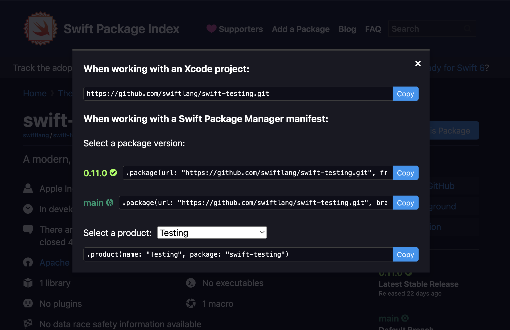
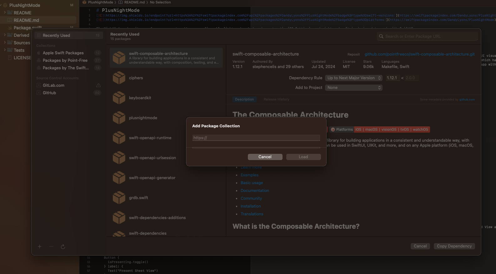
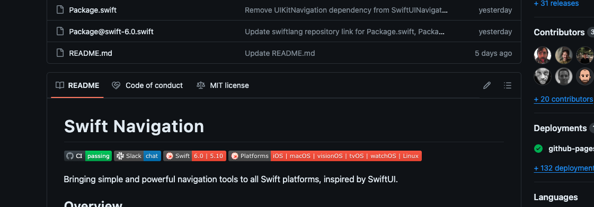

The [Swift Package Index](https://swiftpackageindex.com) (SPI) is an invaluable resource for both package users and maintainers, streamlining the process of discovering, using, and managing Swift packages. Whether you're looking to integrate a package into your project or contribute your own, SPI offers a range of features to maximize your productivity and collaboration. This blog post will guide you through the best practices for leveraging SPI to its full potential.

## Tips for Package Users
### How to Open SPI From GitHub
Perhaps you've already found a package you like on GitHub. You can easily jump to viewing the package on SPI simply by changing the url to `swiftpackageindex.com`. For example, if you are currently at the GitHub repo for the new [Swift Testing](https://github.com/swiftlang/swift-testing) framework at https://github.com/swiftlang/swift-testing then simply change the url to https://swiftpackageindex.com/swiftlang/swift-testing. If the package is already indexed on SPI then it will take you to the page. If not, then it will guide you through an easy process to request adding it to SPI. 

### Try a Package in a Playground
One of the easiest ways to evaluate a new Swift package is by trying it out in a playground. Playgrounds allow you to experiment with the package’s functionality in an interactive and isolated environment without the need to set up a full project. To do this, simply go to a package page on SPI and click the **Try in a Playground** button. This will open a macOS app called _SPI Playgrounds_ which will download the package, and set up a playground for you. There can be quite a bit of boilerplate to set up a package environment in a Swift Playground, but with SPI, it is trivial to try out a package!

### Use a Package
When you've decided that a package is a good fit for your use case, simple click the **Use this Package** button at the top right of the package page. This will show a modal with extremely helpful and concise installation instructions. 

### View Documentation
Comprehensive documentation is crucial for the effective use of any package. SPI simplifies the process of accessing a package’s documentation directly from its index page. Users can view different versions of the documentation, making it easier to refer to the correct information for the specific version of the package they are using. Well-maintained documentation ensures users can implement the package with minimal friction.

SPI's search results helpfully show if a package has documentation. To view documentation, simply go to the package's page and click the **Documentation** button on the right. When you are looking at documentation, notice how it is rendered in Swift's super helpful DocC format, just like Apple's own documentation. There's also a helpful breadcrumb trail at the top of the page so that you can quickly navigate to the package's page or the author's page. At the end of that breadcrumb is a truly killer feature. **You can pick the exact package version that you would like to view documentation for.** Just hover your mouse over the version number to see the available versions. Lastly, if the package contains documentation for multiple targets, then you will also see a breadcrumb for the target. Hover over that, to see the other available targets!

As the API of a library evolves over time, this feature can become invaluable. In fact, SPI's documentation hosting has become so valuable to me, that I tend to use it more often than Xcode's local **Build documentation** feature. 

### Use Package Collections
In Swift 5.5, the Swift Package Manager added support for [Package Collections](https://www.swift.org/blog/package-collections/). These work sort of like an RSS feed for Swift Packages, and SPI auto-generates these Package Collections for you. For example, if you go to https://swiftpackageindex.com/swiftlang this will take you to the author page for **The Swift Programming Language**. Here you can see all of the packages created by this author or organization. At the top of the page is a URL to the Package Collection. You can copy this URL for your own use. 

#### Adding a Package Collection Using Swift's CLI
You can now go to your terminal and type in `swift package-collection add https://swiftpackageindex.com/swiftlang/collection.json`. This will now add the collection to your local collections. Collect many collections onto your machine and now you have all your packages available to search on your local device. And with `swift package-collection refresh` you can ensure that your collections are always up to date. Use `swift package-collection --help` to learn more.

#### Adding a Package Collection Using Xcode
To add a Package Collection to Xcode, go to **File > Add Package Dependencies...**. This will open a modal to add a package to your project. On the left sidebar you can see all the collections you've already added. On the bottom of the sidebar is a **+** button. Click it to add a collection. You can simply paste in that same URL that we got from SPI. There's also a refresh button to refetch the latest data from the package collections. 

## Tips For Package Maintainers
### How To Add Your Package to SPI
Adding your package to the Swift Package Index is straightforward and enhances its visibility to a broader audience. To add your package, you can just click the **Add a package** button at the top of the home page. But there's another option that's even easier. If you're already on the GitHub page for the repo, just change the url to `swiftpackageindex.com` (leaving everything after the domain the same), then this will take you to the SPI page if it exists or an _Add Request_ page. 

By listing your package on SPI, you make it easier for developers to discover and use your work, fostering a larger community around your project.

### Add shields.io Badges

Perhaps you've noticed that many repos today have informative, glanceable badges at the top of their README's. This can display helpful information such as compatibility for Swift language versions, platforms, as well as automated CI testing results. 

SPI automatically runs these tests for you and auto generates the badges for you. All you have to do is paste in a simple code into your repo's README. To add it, go to your package's page, and look for the **Do you maintain this package?** section on the right. Click the link and follow the directions.

### Host Documentation
This is the killer feature of Swift Package Index! Hosting your package documentation is essential for providing users with the necessary information to implement and utilize your package effectively. SPI can build your documentation on your behalf, and host it on their site. You don't have to build your documentation or deploy it. Simply push a new release, and SPI will create your documentation site. All that SPI needs is a little bit of configuration data so that they know how best to build your docs. 

Configurations are stored directly in your repo in a `.spi.yml` file. You can find the docs [here](https://swiftpackageindex.com/swiftpackageindex/spimanifest/main/documentation/spimanifest). They also have a very [helpful tool](https://swiftpackageindex.com/swiftpackageindex/spimanifest/~/documentation/spimanifest/manifestvalidation) to validate your `.spi.yml` file before you upload. The tool is available as a CLI or an [Online Validator](https://swiftpackageindex.com/validate-spi-manifest). 

**SPI will even generate a new documentation site for each version of your library.**

It's worth noting that, generating and hosting documentation is a non-trivial task. Even a small Swift library can hold documentation for thousands of pages. You might only have a few small types in your code, but Swift and DocC could be generating an enormous amount of methods and documentation on your behalf. Simply conforming to common Swift protocols such as `Collection` or SwiftUI's `View` will add a ton of functionality and therefore documentation. Now multiply all of that by all the versions of your library and this can be truly daunting to self-host. SPI abstracts away so much of that complexity. SPI will even retain the major versions of your library. This means it's easy to keep legacy documentation which will make it so much easier for your library user's to migrate. 

### Gather Build Results
Swift is available on so many different language versions and operating systems. Ensuring that your library is compatible (and stays compatible) in all of these environments is prohibitively expensive. Amazingly, SPI handles all of this as well! When you push an update, the [SPI Build System](https://swiftpackageindex.com/docs/builds) will attempt to build for each of these environments, and will display the results on the page. In addition, it will generate shields.io badges, so that users can even see some of these results directly in the README (e.g. when looking on GitHub). Gain a huge insight into how your code builds across a wide array of environments with SPI. 

## Conclusion
By following these tips, both package users and maintainers can take full advantage of the Swift Package Index, creating a more efficient and collaborative environment for Swift development. Whether you're exploring new packages or sharing your own, SPI offers the tools and features necessary to streamline your workflow and elevate your projects. Let me know if I missed one of your favorite features. 