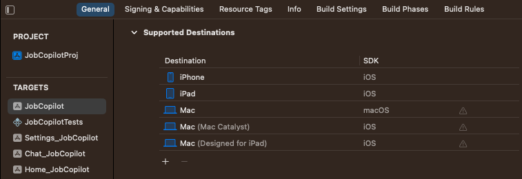
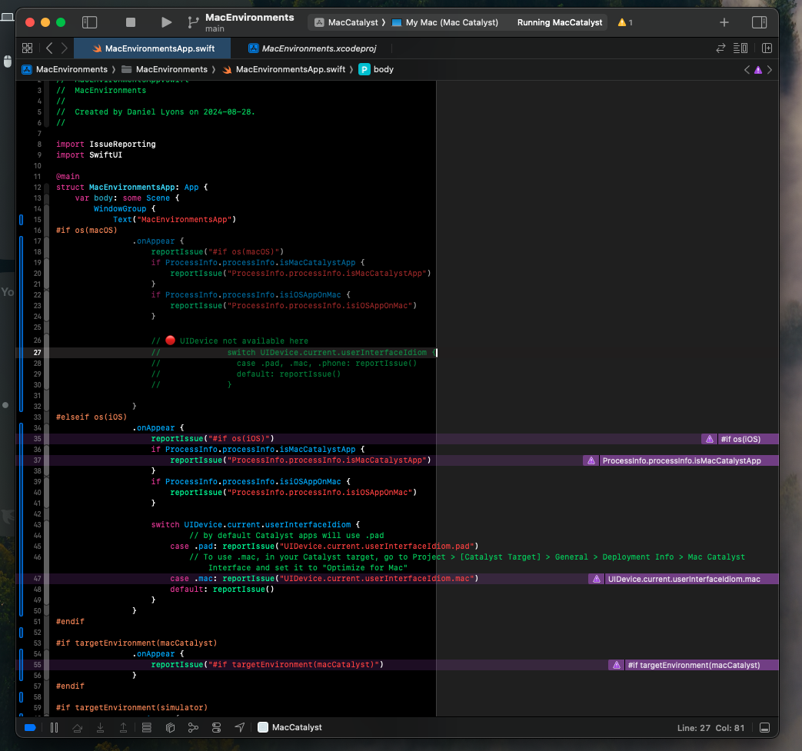

# Demystifying Modern macOS Development

## Introduction

For many years Apple, arguably left the Mac to languish for years while it focused on iOS and the iPhone. The Mac repeatedly got features years later than its mobile cousins, and the hardware was often behind and underpowered. But now, Mac app development is currently in the best state that it has been in a very long time, thanks to three major developments: 

1. Apple released [Catalyst](https://developer.apple.com/mac-catalyst/), which translates iPad apps into native macOS apps. 
2. SwiftUI's _learn once, apply anywhere_ design has made it dramatically easier to share code between macOS and iOS 
3. Apple silicon allows us to run iOS apps natively on the Mac without even translating. 

The good news is that we've never had so many powerful, first-party supported ways to develop Mac apps. **The not so good news is that it's never been so confusing.** Today we will dive into the subtle differences between each of these approaches. 

## Terminology
Let's briefly revisit some terms so that we can understand some of the differences between each of these approaches. 

- **Devices**: Here we'll just focus on iPhone, iPad, and Mac
- **OS**: These are the operating systems. Let's focus on **iOS** and **macOS**. 
- **UI Framework**: For a long time, there were basically two frameworks to be concerned with: 
  - **AppKit**: for macOS and macs
  - **UIKit**: for iOS and iPhones and iPads[^2] 
- **SDK**: Software Developer Kit. These are the tools that we use to build our apps. 
- **Architecture**: Some of these devices have processors that are so different that the software is incompatible with each other. The software must be specifically compiled for the correct architecture. In our current context, there's really just 2 architectures that we are concerned with: 
  - **Intel x86**: Older macs that run on Intel processors
  - **Apple Silicon**: newer macs, and basically all of Apple's mobile devices. 
- **UI/UX Paradigms**: We would love to have a solution that can automatically port our code from one platform to another, but this is only solving half the problem. Macs and iPads are not only different devices and OS's. **Macs and iPads are entirely different UX paradigms.** A Mac is a traditional desktop with a mouse and keyboard. But an iPad, is a touch screen device, with an accelerometer, and GPS, and camera, etc. The point is **these are very different devices with different user expectations.** 

But as we'll see, things started to get even more complicated...

[^2]: In 2019, Apple split iPadOS into its own operating system starting with iPadOS 13. However, this difference is more of a marketing difference than anything else. iPadOS is effectively the same OS as iOS, just running on an iPad, and in fact, in your actual code you will check for `iOS`, not for iPadOS. So in order to reduce complexity, in this article we'll just refer to iOS and that will mean both iPhone and iPad.

## Cross Platform Confusion
For many years, AppKit was effectively the only option available to write Mac apps. Some of AppKit's API's are verbose and don't feel very "modern". But don't let that fool you. AppKit is a very full-featured, robust framework. It is extremely, flexible and powerful. Unfortunately, it is very difficult to make cross-platform apps with AppKit. If you're going to put all that effort into creating an app, wouldn't you want it to be available on as many platforms as possible? Today's customer's expect apps to be ubiquitous, available on practically any platform. Furthermore, users expect each platform to be at full feature parity. This is quite difficult to achieve in AppKit, since most AppKit code cannot be easily ported to other platforms. 

## iPad Apps Translated to macOS Using Catalyst
Apple realized that there are far more iOS developers, than macOS developers, so they created **Catalyst** to port to macOS. Catalyst is specifically for porting **iPad** apps to **Mac**. This means that the same iPad app can run on 2 OS's (macOS and iOS), at least 2 devices (iPad and Mac), 2 architectures (Intel and Apple Silicon), in 2 different UI paradigms (touch-first and Desktop), but they are built with one SDK (iOS). 

## SwiftUI Apps Running Natively on macOS
In 2019, the same year that Apple announced Catalyst, they also announced SwiftUI. For a long time, macOS apps must be written in AppKit, and iOS apps must be written in UIKit, but now they could be written with the same framework: SwiftUI. This means much of the same code can be used on both platforms, but not everything. Many methods are only available on one platform or the other. 

This is why Apple rejects the idea _write once, run anywhere_ and instead describes SwiftUI as _learn once, apply anywhere_. Now this means that the same code[^3] can be run on basically **all of Apple's devices**[^4], basically **all of Apple's OS's**, 2 architectures (Intel and Apple Silicon), in **all of Apple's available UI paradigms** (touch, desktop, watch etc.) and you can choose which SDK you would like to build with. 

[^3]: or rather **almost** the same code
[^4]: iPhone, iPad, Apple Watch, Mac, Apple TV, Vision Pro etc. 

## SDK vs. OS
For a long time the SDK essentially mapped one-to-one to the OS. Building on the iOS SDK created a target that could run on the iOS OS, and only the iOS OS. This is no longer the case. Now you can build a target for the macOS OS using either SDK. 

For example, suppose you want to use the following code on a Mac app. Will it work? 
```swift
struct ContentView: View {
    var body: some View {
        NavigationView {
            Text("Hello, iOS!")
                .navigationTitle("My App")
                .navigationBarTitleDisplayMode(.inline)
        }
    }
}
```

Well the answer is complicated. All of the code above works on macOS except for `navigationBarTitleDisplayMode`. As you can see in the [docs](https://developer.apple.com/documentation/SwiftUI/View/navigationBarTitleDisplayMode(_:)), it is not available on macOS, but it **is** available on Mac Catalyst. So will `navigationBarTitleDisplayMode` work on macOS? The answer is yes, but only when using Mac Catalyst. 

To demonstrate my point, open an Xcode project with a multiplatform target. Click the project in the left sidebar. Now select the target. Now select the "General" tab, and view the "Supported Destinations" section. As you can see in the picture below there are multiple Mac destinations and they have different SDKs. 



| Destination             | SDK   |
| ----------------------- | ----- |
| Mac                     | macOS |
| Mac (Mac Catalyst)      | iOS   |
| Mac (Designed for iPad) | iOS   |

The SDK is very important because it determines which types, methods, etc. your code has access to. As we can see above, Mac Catalyst uses the iOS SDK, which means it has access to the same methods that any iOS app has. 

## What are Multiplatform Apps in Xcode?
Quick aside: What are [Multiplatform apps](https://developer.apple.com/documentation/xcode/configuring-a-multiplatform-app-target) in Xcode? 

In Xcode 14, Xcode added the ability to share code for apps across multiple platforms in a single project, and in a single target! iOS, iPadOS, macOS, visionOS, and tvOS apps can all share a single target![^5] This is a massive quality of life improvement since it dramatically reduces redundant configuration across multiple targets. 

[^5]: Sorry, watchOS apps remain in a separate target.

But you should know that it adds an extra layer of complexity. Just like before, the shared **code** is being used on multiple devices, OSs, and SDKs. But now your **target** is also being used on multiple devices, OSs, and SDKs. Effectively, this means that the multiplatform target settings will resolve to different concrete target settings depending on which platform the target is compiled for. 

Be sure to check out WWDC 2022's video [Use Xcode to develop a multiplatform app](https://developer.apple.com/videos/play/wwdc2022/110371/) for more info.

## Compared Side-by Side

| **Aspect**                 | **Native macOS App (SwiftUI)** | **UIKit App on macOS (Catalyst)**                      | **SwiftUI Mac App (Designed for iPad)**                            |
| -------------------------- | ------------------------------ | ------------------------------------------------------ | ------------------------------------------------------------------ |
| **Operating System**       | macOS                          | macOS (via Catalyst)                                   | macOS (iPad app running on macOS)                                  |
| **SDK Used**               | macOS SDK                      | iOS SDK with Catalyst support                          | iOS SDK                                                            |
| **Primary Framework**      | SwiftUI (with possible AppKit) | UIKit (with Catalyst)[^1]                              | SwiftUI                                                            |
| **Target Device**          | Mac (desktop)                  | Mac (originally iPad)                                  | Mac (originally iPad)                                              |
| **Platform-Specific APIs** | Full access to macOS APIs      | Limited macOS API access via Catalyst                  | Limited macOS API access                                           |
| **Device Input Method**    | Mouse/Trackpad, Keyboard       | Mouse/Trackpad, Keyboard (with some touch adaptations) | Mouse/Trackpad, Keyboard (designed for touch but adapted)          |
| **Use Case**               | Full-featured macOS apps       | Porting **existing** iPad apps to macOS                | Bringing iPad apps to macOS with minimal changes                   |


[^1]: It is also possible to convert an SwiftUI iOS app to macOS using Catalyst, however, this approach tends to be less common since it's usually easier to run the same SwiftUI code directly in a macOS app (with minor adjustments). 

## Determining Which Environment You Are Running In
Swift provides us with a number of tools to 

- `#if os()`: This name is unfortunately deceptive. In my testing. `#if os()` actually checks the SDK, **not** the OS. 
  - `#if os(iOS)`: For example a Mac Catalyst app will execute `#if os(iOS)`, even if running on macOS. 
  - `#if os(macOS)`: And this will **only** execute on a Mac app if it is built with the Mac SDK. 
- `#if canImport()`: We can use this compiler directive to check for UIKit or AppKit. 
  - `#if canImport(AppKit)`: This will work for native Mac Apps.  
  - `#if canImport(UIKit)`: This will work for Mac (Designed for iPad) apps
  - **What about Mac Catalyst?**: Apparently the answer is both. 
- `#if targetEnvironment(macCatalyst)`: This directive can be very helpful when you need code to exclusively run on the Mac Catalyst version. 

## Introducing MacEnvironments: A Reference App
Is your brain melting yet? Fret not. I've created [MacEnvironments](https://github.com/DandyLyons/MacEnvironments). It's a helpful Xcode project designed to make it easy to reference which code will execute on which Mac environment. It has 3 targets: **Mac**, **MacCatalyst** and **MacDesignedForiPad**. There's basically only one file you need to care about: `MacEnvironmentsApp.swift`. This is the entry point to the app. It only does one thing: it runs a bunch of `.onAppear()` code blocks. These blocks are surrounded in environment checks such as `#if os(iOS)` and many more. When you build and run the app, Xcode will display a helpful purple message right next to each block of code that ran, and it wil **not** display a message next to the blocks that did not run. The results will probably surprise you!



_Here's an example of what **MacEnvironments** looks like when you build it for Mac Catalyst._ 

I want to give a big thank you to PointFree for releasing IssueReporting. This is the powerful library that powers the purple runtime warnings. Make sure you check it out [here](https://github.com/pointfreeco/swift-issue-reporting). 

## Conclusion
Choosing the right approach for developing a Mac app depends on your project requirements, target audience, and development resources. Whether you opt for a native SwiftUI app, leverage Catalyst, or port a SwiftUI app designed for iPad, understanding the strengths and challenges of each method is key to creating a successful Mac application.

