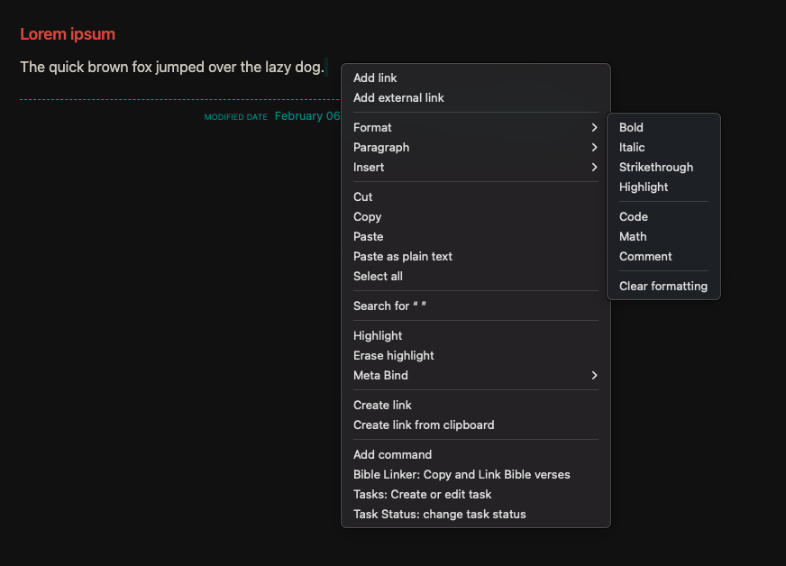
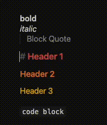

# Essential Obsidian: Formatting

Today we start a new series on one of my favorite note-taking apps, [Obsidian](https://obsidian.md/). In this series, we'll cover the basics of Obsidian. Here we will intentionally NOT be doing anything particularly fancy. We won't be using strange plugins or custom CSS. Instead we'll be focusing on the most helpul, core features that I use every day. Beginners will be able to finally overcome the initial learning curve and start using Obsidian effectively. And experienced users will find helpful tools to simplify their setup! 

## What is Obsidian?
Obsidian is a note-taking app with three key superpowers that I want to highlight:
1. Local-first and offline: These are your notes, stored on your computer, and controlled by no one else. 
2. Extremely customizable: Practically anything that you can think of doing with your notes, you can do in Obsidian.
3. Markdown-based: Obsidian uses Markdown for all of its notes. This means that you can write your notes in plain text, and they will be rendered beautifully in Obsidian.

## How the heck do I make my text bold? 
Usually when I tell people about Markdown they seem like their on the same page, until they see Markdown. It seems like a strange programming language and let's face it, many of us don't want to learn something that looks confusing and intimidating. We just want to take notes and do simple things like make our text bold. I hear you. Let's make this simple.

## The Formatting Menu in Obsidian
Most of us are familiar with traditional word processors like Microsoft Word or Google Docs. These tools are what is known as a **WYSIWYG** editor. WYSIWYG stands for "**What You See Is What You Get**." They're called that because you can simply highlight your text and click a button to change the way that it looks. For example, to make your text bold, just highlight it and click the bold button.

WYSIWYG editors are great because they're simple and easy to use, at least at first. But they have some downsides, which we'll talk about in a bit. For now, let's focus on how to make Obsidian as easy to work with as a WYSIWYG editor.

 

First, simply highlight any text in your note. Now right-click on the highlighted text. You'll see a menu pop up. Now hover your mouse over the "Format" button and you'll see a list of formatting options. Click on the formatting option that you want to apply to your text and that is it! You've just formatted your text in Obsidian. You should see your change happen immediately in the editor. In a bit, we'll learn how to make this even easier, but first let's talk about some of the problems with WYSIWYG editors.

## The Problem with WYSIWYG Editors
Tell me if this has ever happened to you. You're writing a document in Word or Google Docs. You're making your text bold, italic, and adding links. Everything looks great. But then you copy and paste that text into an email, or a chat, or a website, and it looks terrible. The bold text isn't bold anymore. The italic text isn't italic anymore. The links don't work. For some reason the font size is four times too small to read. What happened?

The problem is that **WYSIWYG editors are great for making your text look good in that one program, but they're terrible for making your text look good in other programs**. The reason is that WYSIWYG editors use a lot of fancy formatting that only works in that one program. When you copy and paste that text into another program, all of that fancy formatting is lost.

But plain text is different. Plain text is just text. It doesn't have any fancy formatting. It's just text. And that's why Markdown is so powerful. Markdown is just text. 

Plain text is like a universal language. It can be read by practically any computer program with no issue whatsoever. But plain text is a little... well plain. It doesn't have any formatting, which means we can't do basic things like make our text bold. 

That's where Markdown comes in. It's a very simple way to add formatting to plain text. But the best part is it is **human-readable**, which means that even if you don't know Markdown, you can still read it. It almost looks like something you would naturally write with pen and paper.


## Don't Be Afraid of Markdown
Don't be afraid of Markdown. I repeat, do not be afraid of Markdown. It adds some extra features to your text, but it's still just text. You can write your notes in plain text and they will look great in Obsidian. Better yet, those plain text files can be read in almost any other computer program. Google Docs, Notion, Slack, Discord, you name it. They can all read plain text files. New programs come and go. But plain text files are forever.

Now, what kind of extra features does Markdown add? Formatting. That's it. Markdown is just a way to format your text. You can make your text **bold**, _italic_, or even add [links](https://example.org/). That's it. That's all Markdown does. It's not a programming language. It's just a way to format your text. And don't worry, it is dead simple to use. 

Do yourself a favor and bookmark [this page](https://help.obsidian.md/Editing+and+formatting/Basic+formatting+syntax). It's the official Obsidian help page on Markdown. Don't worry about memorizing or even learning it all. Just bookmark it, and focus on remembering the features that you use most often. Here's a few to get you started: 

## Basic Markdown Formatting
- **Bold**: `**bold**`
  - You can also highlight text and press `⌘ + B` on Mac or `Ctrl + B` on Windows to make it bold.
- _Italic_: `_italic_`
  - You can also highlight text and press `⌘ + I` on Mac or `Ctrl + I` on Windows to make it italic.
- ~~Strikethrough~~: `~~Strikethrough~~`

As you can see the above formatting is very simple. Just add some extra characters before and after your text to format it. 


- Bullet point list: `- List`
  - A bullet point list can be created by adding a `-` before each item.
- 1. Numbered List: `1. Numbered List`
  - A numbered list can be created by adding a number followed by a `.` before each item.
- `Heading 1`: `# Heading 1`
  - Headings can be created by adding `#` before your text. The number of `#`s determines the size of the heading. 
- Tasks (Checkboxes): 
  - [ ] An unchecked task can be created by adding `- [ ]` before your text.
  - [x] A checked task can be created by adding `- [x]` before your text.
  - If you click on the checkbox, it will automatically check or uncheck the task, and update the Markdown syntax.
  - Obsidian even has powerful task management features that can be used with these tasks. Read all about it [here](https://help.obsidian.md/Editing+and+formatting/Basic+formatting+syntax#Task+lists).

That's it! That's all you need to know to get started with Markdown. Plus learning Markdown is an incredibly useful skill. It's used in many different places, not just Obsidian. 

## Source Mode, Reading View, and Live Preview
Remember, Obsidian is just a plain-text Markdown editor. The only thing that you are actually editing is a plain text file. But Obsidian has three different ways to view your notes. 

1. **Source Mode**: This is the raw Markdown text. This is what you are actually editing.
2. **Reading View**: This is what your note will look like when you export it. It looks just like a simple webpage, but you can't edit it.
3. **Live Preview**: This is a live preview of your note. It looks just like the Reading View, except that you can edit it, just like in Source Mode!

You can switch between these three views, but the truth is, **I spend almost all of my time in Live Preview**. It's the best of both worlds. You can see what your note will look like when you export it, and you can edit it at the same time.

Live Preview is so simple to use that it almost feels like a WYSIWYG editor, but there is one thing that you need to be aware of. Even though it looks like a WYSIWYG editor, you are still editing a plain text file, with Markdown syntax in it. Live Preview does a fantastic job of hiding the Markdown syntax, so that we can focus on our writing, but it is still there. For example look at this: 



As you can see, the text appears to change, depending on where the cursor is. This is because the Markdown syntax is being hidden. But when the cursor moves into a section of text that has Markdown syntax, the syntax is revealed. So when the cursor moves into the word "bold", then the `**` characters are revealed before and after the word. The truth is, those `**` characters are always there, but Live Preview is only showing them when you need to see them.

Let's try formatting our text using Markdown instead of the formatting menu. Find some text in your note that you want to make bold. Now add `**` before and after the text. You might not see a change yet, but that it totally okay. Live Preview hasn't hidden the `**` characters because your cursor is still inside that portion of text. Simply move your cursor to another portion of text and you should see your text become bold, and the `**` characters disappear!

Remember that Format menu that we used earlier? It's doing the same thing. It's just adding Markdown syntax for you. So you can pick whatever method is easiest for you. You can type out the Markdown syntax yourself, or better yet, you can just push a button in the Format menu, and Obsidian will type the Markdown syntax for you.

Now that we understand Live Preview mode, let's talk about how to make formatting even easier!

## The "Editing Toolbar" Plugin
The problem with the Format menu is that there are only a few options in it, and you have to right-click to access it. How can we get a big helpful formatting toolbar like in Word or Google Docs? The answer is the "Editing Toolbar" plugin.

In Obsidian, you can add new features to the app by installing plugins. Obsidian has Core plugins that are built into the app[^1], and Community plugins that are created by the community. The "Editing Toolbar" plugin is a Community plugin that adds a big helpful formatting toolbar to the top of the editor. You can add bold, italic, and any other formatting options with just a click of a button.

[^1]: The cool thing is this means that you can turn off features that you never use, which means that you can reduce clutter and keep Obsidian simple.

You can find the Editing Toolbar plugin [here](obsidian://show-plugin?id=editing-toolbar) and if you've never installed a plugin before, you can read all about it [here](https://help.obsidian.md/Advanced+topics/Plugins).

Now, just like the Format menu, the "Editing Toolbar" plugin is just adding Markdown syntax for you. There is no fancy Rich Text formatting going on. It's just adding Markdown syntax. Which means that the Editing Toolbar is also a great way to learn Markdown as well. Simply click any formatting button in the Editing Toolbar and you'll see the Markdown syntax appear in your note!

This "Editing Toolbar" plugin is jam-packed with features that even most advanced Markdown users will appreciate. You can add tables, code blocks, and even emojis with just a click of a button. It's a fantastic way to make Obsidian even easier to use.

## Formatting With HTML
Now feel free to skip this section if HTML is not your thing. But you should know that Obsidian can render HTML in your notes. For those who don't know HTML is the language that websites are written in. It's a very powerful, extremely flexible language. Let's look at a very simple use case that will come in handy for almost everyone.

### Underlining Text
Practically every word processor has a way to underline text. But Markdown doesn't have a way to underline text[^2]. That's not a problem because we can use HTML to underline text. Here's how you do it:

```html
This text is not underlined. <u>But this text is.</u>
```

[^2]: Well, the issue is that by default, links in web browsers are underlined. So if Markdown had a way to underline text, it would be very confusing to know if a link was underlined because it was a link, or because it was underlined. So Markdown doesn't have a way to underline text. If I was dictator of the world, I would make `_this_` syntax underline text, but alas I am not and that ship has sailed.

Paste that text into Obsidian and it should render like this:

>This text is not underlined. <u>But this text is.</u>

This syntax is quite simple, so let's break it down. HTML applies formatting using _tags_. Tags are enclosed in angle brackets, like this `<tag>` opening tag and this `</tag>` closing tag. The `<u>` tag is used to underline text. So to underline text, you simply add `<u>` before the text that you want to underline, and `</u>` after the text that you want to underline.

But again, the Editing Toolbar plugin makes this much easier for us. Just highlight the text, and click the "<u>U</u>" button in the Editing Toolbar. The Editing Toolbar will add the HTML tags for you.

### Superscript and Subscript
Another common formatting option that is missing from Markdown is superscript and subscript. But again, we can use HTML to add these formatting options. Here's how you do it:

```html
a<sup>2</sup> + b<sup>2</sup> = c<sup>2</sup>
log<sub>2</sub>(8) = 3
```

Paste that text into Obsidian and it should render like this:

>a<sup>2</sup> + b<sup>2</sup> = c<sup>2</sup>
<br>
log<sub>2</sub>(8) = 3

Again, the Editing Toolbar makes this much easier for us. 

## Other Formatting Options

Finally, let's do a lightning round of some other helpful formatting options that you can use in Obsidian. Thankfully, these ones are all built into Markdown, so you don't need to know HTML to use them. I'll show you what they look like here. Be sure to check out the [official Obsidian help page on Markdown](https://help.obsidian.md/Editing+and+formatting/Basic+formatting+syntax) to see how to use them for yourself[^3]. Also, remember that the Editing Toolbar plugin can add all of these formatting options for you.

[^3]: I'm serious. You really need to bookmark that page. It's incredibly helpful.

### Footnotes

A footnote is a little note that you can add to your text. It's usually at the bottom of the page. Here's what a footnote looks like:

```markdown
This is a sentence with a footnote[^1].

[^1]: This is the footnote. Note that the number in the square brackets matches the number in the footnote. Also, note that in Markdown, the footnote can be anywhere in the document. It doesn't have to be at the bottom of the page. It will be rendered at the bottom of the page in Reading View, but you can put the Markdown for the footnote anywhere in the document.
```

Paste that text into Obsidian and it should render like this:

>This is a sentence with a footnote[^4].

[^4]: This is the footnote. Note that the number in the square brackets matches the number in the footnote. Also, note that in Markdown, the footnote can be anywhere in the document. It doesn't have to be at the bottom of the page. It will be rendered at the bottom of the page in Reading View, but you can put the Markdown for the footnote anywhere in the document.

### Blockquotes

Blockquotes are a way to highlight text. They are often used to show that a piece of text is a quote from another source. Here's what a blockquote looks like:

```markdown
> This is a blockquote. It's a way to highlight text. It's often used to show that a piece of text is a quote from another source.
```

Paste that text into Obsidian and it should render like this:

> This is a blockquote. It's a way to highlight text. It's often used to show that a piece of text is a quote from another source.

### Callouts
Callouts are a way to highlight text. They are often used to show that a piece of text is important. Now callouts are a part of Markdown, but there is a bit of a catch. Not every program that reads Markdown has all of the same features. There are [standard features that are part of the Markdown specification](https://www.markdownguide.org/basic-syntax/), but there are also features that are unique to each program. Sometimes these unique features are called "flavors" of Markdown. They are like _dialects_ of Markdown.

Callouts are a part of what we call [Obsidian-Flavored Markdown](https://help.obsidian.md/Editing+and+formatting/Obsidian+Flavored+Markdown). (Also, [GitHub-Flavored Markdown](https://github.github.com/gfm/).) Make sure you read about callouts in the official [Obsidian page](https://help.obsidian.md/Editing+and+formatting/Callouts) on Callouts.

### Code Blocks
Code blocks are a way to show examples of code in your notes. When writing code in Markdown, it's important to use code blocks, so that your code is easier to read. Plus, many programs add a very helpful copy button to code blocks. You can read about code blocks in the official [Obsidian page](https://help.obsidian.md/Editing+and+formatting/Basic+formatting+syntax#Code+blocks) on Code Blocks.

### Tables
Tables are a helpful way to organize information in your notes. You can read about tables in the official [Obsidian page](https://help.obsidian.md/Editing+and+formatting/Advanced+formatting+syntax#Tables) on Tables.

Here is an example of a table:

```markdown
| Header 1 | Header 2 | Header 3 |
|----------|----------|----------|
| Row 1    | Row 1    | Row 1    |
```

Paste that text into Obsidian and it should render like this:

| Header 1 | Header 2 | Header 3 |
|----------|----------|----------|
| Row 1    | Row 1    | Row 1    |

Let me tell you that tables are a bit of a pain to write by hand. But thankfully, Obsidian has the best Markdown table editor that I have ever found. Using a table in Obsidian's Live Preview Mode is as easy and intuitive as using a table in Excel!


### Images
Obsidian and Markdown makes it very easy to add images to your notes. But alas we'll be exploring this in next week's post when we talk about links. 

## Conclusion
This was a deep dive into formatting your notes in Obsidian. But the truth is, we only scratched the surface. There are so many more formatting options in Markdown, and Obsidian-Flavored Markdown, in HTML, and even in Community plugins. But the good news is that you don't need to know all of them. You only need to know the ones that you use most often.

I hope that this article will open your mind up to the deep possibilities. If you get one takeaway from this article, I hope that it is this. **Markdown and Obsidian are just tools to help you write and think.** There are many powerful tools out there, and some like Notion, or Google Docs may be simpler and more intuitive to use. But the power of Markdown and Obsidian is this: 

1. No one controls your notes but you. 
2. You can customize your notes in any way that you want. The skies are the limit. 

With just a little bit of work and learning, you can make Obsidian uniquely yours. And that is a very powerful thing.

<br>
<br>
<br>
<br>
<br>
<br>
<br>
<br>
<br>