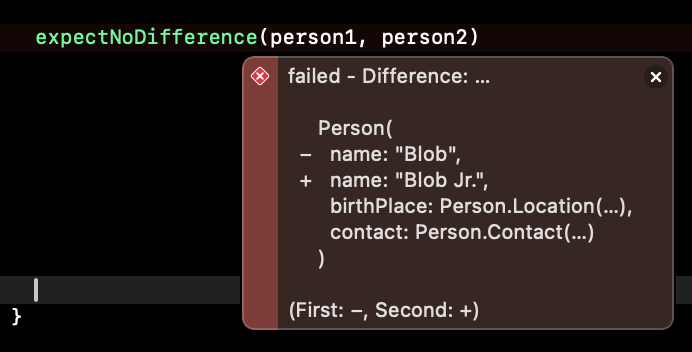

Testing is vitally important in virtually any tech stack. That is, unless you want to [shut down 8.5 million computers worldwide](https://en.wikipedia.org/wiki/2024_CrowdStrike_incident). [^1] Testing is more than a tedious chore. It's an automated warning system of current bugs. What is not automated (at least not entirely) is writing the tests. It takes time to write tests, and we have to know what needs to be tested. No matter how well your tests are written, if your tests don't cover a particular situation, then it won't be caught. This means that we need to assert on every value in our code. This is tedious and error-prone.

[^1]: Ok, that jab is not quite fair. Crowdstrike, did have testing, but clearly it wasn't very good. 

What if I told you there was a way to test all of your values exhaustively? Today we'll talk about "Exhaustive Testing" and as an added bonus, we'll talk about how to restore exhaustive testing when we have lost `Equatable` conformance. 

## The Problem With Non-Exhaustive Testing
Here's a trivial example. Suppose, you had a `Person` class like this:
```swift
class Person {
  var name: String?
  var hasName: Bool {
    name != ""
  }
  init(name: String) {
    self.name = name
  }
}
```
You realize that there is some hidden behavior here. `hasName` is effectively a function that calculates if the `Person` has a name. We need to test if this computed variable produces the correct result: 
```swift
func testPersonHasName() {
    let person = Person(name: "Blob")
    XCTAssertEqual(person.hasName, true) // ✅ test passed
}
```
Hooray! The test passed! Nope. This is a bad test, and it gives a false sense of security. If we add just a little more to our test, we'll find the bug. 
```swift
func testPersonHasName() {
    let person = Person(name: "Blob")
    XCTAssertEqual(person.hasName, true) // ✅ test passed
    person.name = nil
    XCTAssertEqual(person.hasName, false) // 🔴 test failed
}
```
`name` is now `nil`, so we should expect `hasName` to be `false`. It's not, and now we have a failing test proving that we have a bug in our code. We forgot to check for `nil`. But don't forget, **we only have this failing test because we remembered to test this case**.

The problem with non-exhaustive testing is [unknown unknowns](https://en.wikipedia.org/wiki/There_are_unknown_unknowns). You simply do not, and cannot know, what you do not know. The answer to this problem is simple[^4]: more tests. Let's test as much as we can so that we don't miss anything. But that leaves us with less time to develop new features, and in some cases may even give us a false sense of security. 

[^4]: but not easy

## The Value of Exhaustive Testing
In principle, **Exhaustive Testing** means testing **every** part of your code exhaustively. This way you have to explicitly predict the exact state of your code so that you can prove that it behaves reliably. You might be thinking, "Well, that sounds... exhausting." It's actually not. In fact, it often results in shorter, simpler tests.

Now let's imagine if our `Person` class grew to something a little more complex. 
```swift
public class Person {
  var name: String?
  var birthPlace: Location
  public struct Location {
    var country: String
    var city: String
    var address: String
  }
  
  var contact: Contact
  public struct Contact {
    var phone: String
    var email: String
    var address: String
  }
  
  
  var hasName: Bool {
    name != "" && name != nil
  }
  // ...
}
```
Now, this is much more laborious to test, if we use the same strategy. We would have to assert on the value of each and every property in the type. We'd even have to assert on the value of the nested types. In practice, what will actually happen is we'll focus "important" stuff and leave the edge cases untested. 


Now let's try testing with an exhaustive approach. One way to test exhaustively is to assert on the entire value of the `Person`. 
```swift 
XCTAssertEqual(person1, person2)
```

This is much better. Now we are asserting on the entire value!

But there are three problems to this approach. 

First, `XCTAssertEqual` requires that the types be `Equatable`. For structs this is usually not very hard. We just conform our type to `Equatable` and Swift will automatically write the implementation for us, most of the time. For classes, you have to write the implementation yourself, and it's actually a lot more complex than it may seem.[^5]

[^5]: Equatability for reference types such as classes and actors is a deeply involved topic and should not be considered the same as equatability for value types such as structs and enums. This is because reference types encapsulate not only value, but also object identity. For more information on this complexity, I recommend checking out [this episode](https://www.pointfree.co/episodes/ep254-observation-the-gotchas#gotcha-value-reference-equatability-hashability) of pointfree. 

The second problem comes from manually implementing `Equatable`. As your codebase evolves over time, you will eventually need to change the properties of your types, but your `Equatable` conformance will not be automatically updated. This means your tests will incorrectly assert on your outdated `Equatable` implementation! 

Third, in order to automatically synthesize an `Equatable` implementation, you must add `Equatable` to the type definition (it won't synthesize an implementation if you add it to an extension). In other words, if you don't own the type (i.e. if the type comes from a library that you can't edit), then you lose automatic `Equatable` implementation. 

## Introducing Pseudo-Exhaustive Testing
I'd like to introduce another approach that I call **Pseudo-Exhaustive Testing** which is faster, easier, and safer. 

The Swift standard library comes with a very helpful function called [dump](https://developer.apple.com/documentation/swift/dump(_:name:indent:maxdepth:maxitems:)). `dump` will print an entire type, and all of it's nested properties to the console. 

```swift
dump(person)
//Person #0
//▿ name: Optional("Blob")
//- some: "Blob"
//▿ birthPlace: Person.Location
//- country: "Some Country"
//- city: "Some City"
//- address: "Some Address"
//▿ contact: Person.Contact
//- phone: "Some Phone Number"
//- email: "Some Email"
//- address: "Some Address"
```

But even better, we can provide a text output stream to `dump`. In other words, we provide it a `String` to write to. Now we can easily write a test like this, and assert on the value of every single nested property, and we didn't even need to conform to `Equatable`! 

```swift
let person1 = Person(/*...*/)
let person2 = Person(/*...*/)
var person1String = ""
var person2String = ""
dump(person1, to: &person1String)
dump(person2, to: &person2String)
XCTAssertEqual(person1String, person2String)
```
I can't stress enough how revolutionary this approach is. If we used the property assertion method, we would need to tediously assert on every single nested property. If we remove or change a property, then now our test is broken. Even worse, if we add a property to our type, we need to remember to add the assertion to our test. If we forget, then the test will incorrectly pass, and we'll have false security.

On the other hand, things aren't much better with the equatable asertion method. The test is easier to write, but we've just shirked the responsibility to the `Equatable` conformance. Even worse, if we had to manually conform to `Equatable` then we have the same problems. If we remove a property, then we break `Equatable`. If we add a property then we need to remember to add it to our `Equatable` conformance. Except now, if we forget to add it to `Equatable`, we not only get a false positive in our test, we also get incorrect behavior in our production code! Perhaps the only thing worse than a missing test, or an incomplete test, is a false passing test!

So why do I call it **Pseudo-Exhaustive Testing**? It is important to note that we are not asserting directly on the values themselves. We are asserting on the string values of the dump output. In most cases the dump output string equality should directly match the equality of the values themselves. But nevertheless, we are still asserting on string representations of the values, rather than asserting on the values directly. So there are edge cases where two values could dump the same string, and thus the test would return a false positive. In my estimation, in most cases this will not be a major concern. Later I will recommend how best to handle this. 

## Gaining Helpful Diff Reports
We can make exhaustive testing more ergonomic by adding diff print outs for failures! [Pointfree](https://www.pointfree.co/) has created a fantastic library named [CustomDump](https://swiftpackageindex.com/pointfreeco/swift-custom-dump#user-content-expectnodifference), which takes the same concept as Swift's `dump` and adds some extra super powers. 

This library includes a very helpful method called [expectNoDifference](https://swiftpackageindex.com/pointfreeco/swift-custom-dump/main/documentation/customdump). `expectNoDifference` basically does the same thing that we did earlier in our dump assertion strategy, except even better. First, `expectNoDifference` requires that the types conform to `Equatable`. This means that it is actual Exhaustive Testing and not mere Pseudo-Exhaustive Testing. But there's another huge benefit which we can see in the image below. `expectNoDifference` will not only assert on the values but if the test fails, it will show a concise diff with the precise property that is different. This can be incredibly valuable when dealing with very large, nested types. I strongly recommend replacing `XCTAssertEqual` with `expectNoDifference` in most cases!


```swift
var person1 = Person(/*...*/)
person1.makeSomeMutation()
let person2 = Person(/*...*/)
expectNoDifference(person1, person2)
// Now we have proof of every change that happened in `makeSomeMutation()`
```



Once again, however, we must conform to `Equatable`, which may not always be feasible. Does this mean we also have to lose those convenient diffs? No. Once again we can implement Pseudo-Exhaustive Testing. The `CustomDump` library has another function called `diff` which powers the diff output of `expectNoDifference`. We can make a function which will pass if there is no difference in the dump.  

```swift
func expectNoDifferenceInDump<T>(_ lhs: T, _ rhs: T) {
  if let diff = diff(lhs, rhs) {
    XCTFail(diff) // fail and show the diff
  } else {
    XCTAssertTrue(true) // pass if there's no difference in the dump
  }
}

// Usage:
expectNoDifferenceInDump(person1, person2)
```

## Exhaustive Testing Recommendations
I recommend starting with Exhaustive Testing for most use cases. If and when you come to a use case where `Equatable` conformance is not available and cannot be automatically synthesized, then I recommend switching to a hybrid approach using Pseudo-Exhaustive Testing and Non-Exhaustive Testing. Use the Non-Exhaustive Testing to test mission critical business logic, and use Pseudo-Exhaustive Testing to cover blind spots. Also, change how you think about tests for a Pseudo-Exhaustive Test. When a Pseudo-Exhaustive Test passes, you should not think of it as a true passed test, but instead you should think of it as a pseudo passed test. In other words, don't think of it as proof that your code behaves as expected. Instead, think of it as proof that your test has not found any failing edge cases from a dump. This type of test may not be as reassuring as a Non-Exhaustive Test or a truly Exhaustive test, but it is still a valuable tool in your toolbelt. It will make you aware of blind spots in your test suite, which you can then fill with Non-Exhaustive tests. 

If you are using a manual implementation of `Equatable` then I recommend also using Pseudo-Exhaustive Testing. This could help alert you to incorrect or out of date `Equatable` implementations. (Don't forget, that even if your `Equatable` implementation is automatically synthesized, if a property has a manual `Equatable` implementation, then your parent type still depends on that manual implementation.)

## Conclusion
Today, we assessed a variety of testing styles along the spectrum of exhaustivity. We looked at Non-Exhaustive, Exhaustive and Pseudo-Exhaustive Testing. We've seen how Exhaustive Testing can be faster to write, and more thorough, covering even edge cases that you forgot to consider testing.

Still I don't want to replace one false sense of security with another. Exhaustive Testing is very valuable, but it is no silver bullet. The name is even a little misleading. For example, it is exhaustive over every child property in a type, but it is not exhaustive over every function. Nor is it exhaustive over side effects from outside dependencies and so forth. My intention with this blog is not to claim that I've found a silver bullet to kill all bugs.

The point is to show that with exhaustive testing, we are exhaustively asserting on every value of every nested property. This is deep test coverage. We are testing issues that we likely would have never considered, and it turns out, it's actually easier to write as well. 